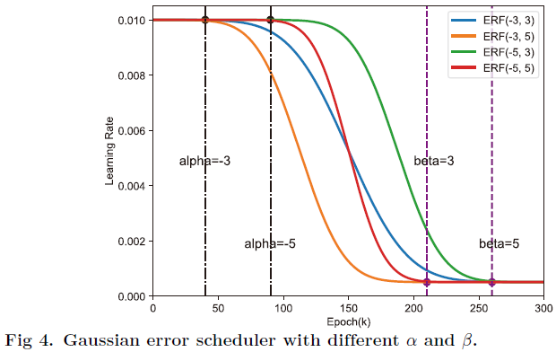
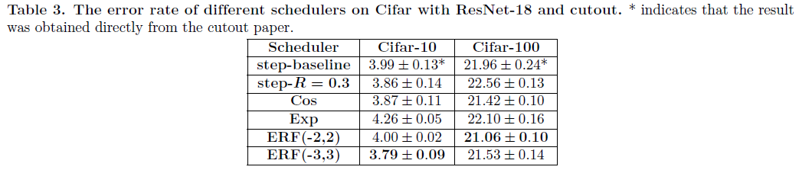

## ERF

### Gauss error scheduler

In mathematics, the Gaussian error function\cite{22chang2011chernoff} is a non-basic function, which is widely used in probability theory, statistics, and partial differential equations. It is defined as

$$
erf(x)=\dfrac{2}{\sqrt{\pi}}\int{0}^{x} \exp(-t^2)\,dt.
$$

According to the properties of the Gaussian error function, we design a Gauss error scheduler (denote as ERF), which controls the learning rate according to:

$$
ERF(\alpha, \beta)=lr_{min}+\dfrac{lr_{max} - lr_{min}}{2}(1-erf(\dfrac{e(\beta - \alpha)}{E} + \alpha)),
$$

where $lr_{max}$ is the maximum learning rate and $lr_{min}$ is the minimum learning rate. $E$ is the total number of epochs. $e\in (0, E]$ is the current epoch. $\alpha$ is a negative integer and $\beta$ is a positive integer. Fig 4 shows the learning rate curves of Gaussian error scheduler with different $\alpha$ and $\beta$. The time that CNN trains at the initial learning rate is determined by $\alpha$. When $|\alpha|$ is larger, the longer CNN trains using the $lr_{max}$ learning rate. The time that CNN trains at the small learning rate is determined by $\beta$. When $\beta$ is larger, the longer CNN trains using the $lr_{min}$ learning rate. The ratio $|\alpha|/|\beta|$ determines the learning rate decay rate.

When the learning rate is close to zero, the noise will dominate the update of the CNN weights. It is inappropriate to set the learning rate approach to zero in the later period, which can cause fluctuations and declines in the test accuracy during the final period. So we have the $lr_{min}$ parameter of Gaussian error scheduler to ensure that the learning rate does not close to zero, and we think the $lr_{min}$ does not require fine-tuning very carefully. In this paper, $lr_{min}$ is set to the minimum learning rate of step scheduler and $lr_{max}$ is set to the initial learning rate of step scheduler.

## Results and Usage   

### Dependencies  

[PyTorch 0.4.0](https://pytorch.org/)

### Results

Test error (mean of 3 runs) 

### Usage

`bash run.sh`
