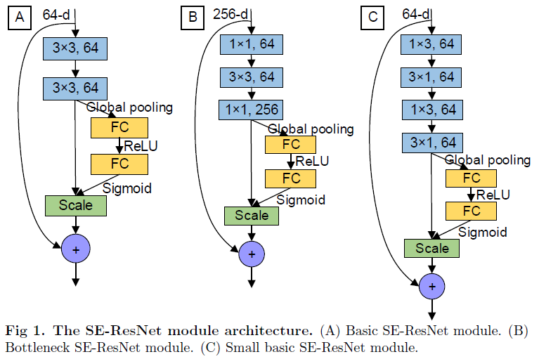
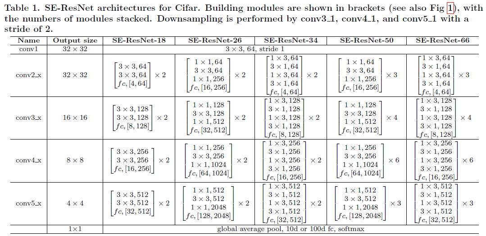
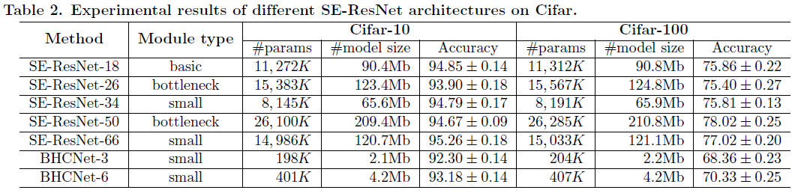

# The small SE-ResNet

## Introduction

The small SE-ResNet is a combination of Squeeze-and-Excitation block (SE block) and the residual block of the ResNet. The SE-ResNet module has three different structures:

A) basic SE-ResNet module - with two consecutive $3\times 3$ convolutions with batch normalization and ReLU preceding convolution: $conv 3\times 3-conv3\times 3$.(Fig1A)

B) bottleneck SE-ResNet module - with one $3\times 3$ convolution surrounded by dimensionality reducing and expanding $1\times 1$ convolution layers: $conv 1\times1-conv 3\times 3-conv1\times 1$(Fig1B).

C) small SE-ResNet module - with two consecutive $1\times 3$ and $3\times 1$ convolutions with batch normalization and ReLU preceding convolution: $conv 1\times3-conv3\times1-conv 1\times3-conv3\times1$(Fig1C).

We describe the 146 architectures of SE-ResNet in Table 1.

## Results and Usage   

### Dependencies  
[Keras 2.1.3](https://keras.io)

[TensorFlow 1.4.0 or 1.8.0](http://tensorflow.org)

### Results
Test error (mean of 3 runs) 

### Usage

`bash run.sh`

